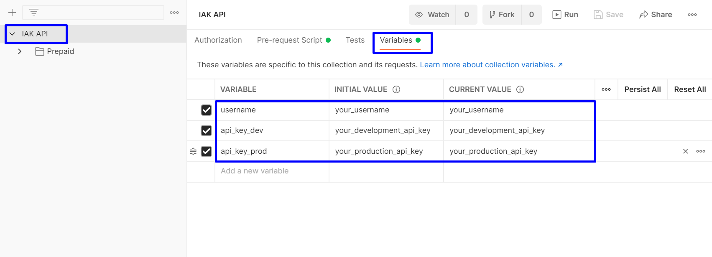
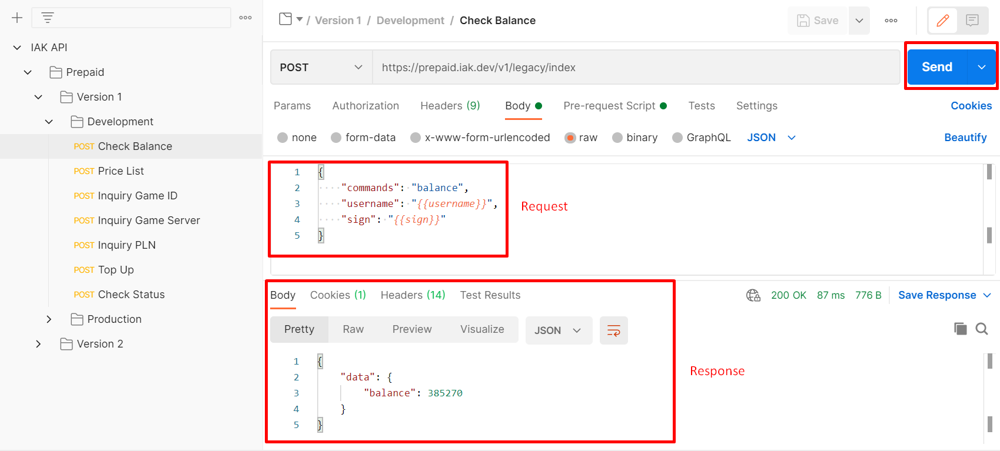
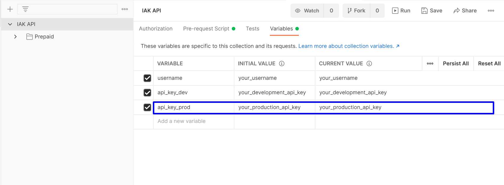

# Postman Collection

Postman is one of a platform to test REST API. IAK provides Postman Collection that can be used to test IAK API in Postman.

## How to Use

Below is step by step how to use postman collection that IAK already provides.

  1. If you don't have postman, download [here](https://www.postman.com/downloads).
  2. Click **Run in Postman** button to import the collection.

  

  3. In the postman, click **IAK API** folder on left sidebar and choose **Variables**. 
  
  

  Change variable value with the following:
  
  - **username**: Your user hp
  - **api_key_dev**: Your api key development. 
  - **api_key_prod**: Your api key production. (Skip this if you want to test production)

<!-- theme: info -->

> Get you API key [here](https://developer.mobilepulsa.net/home)
  
  4. Lets try to send a request. 
  

  Do the following step to test check balance api:
  
  - Go to **IAK API > Prepaid > Version 1 > Development > Check Balance**. 
  - Click Send button in above corner right.
  - The server response is displayed below.
  - Explore the other API in the collection.

## Production Mode

To test production environment with postman collection, simply do the following steps:

  1. Fill the **api_key_prod** variable with your API key production.

<!-- theme: info -->

> Get you API key [here](https://developer.mobilepulsa.net/home)

  2. In **Production** subfolder, send the request like in [How To Use](#how-to-use) **steps 4**
  3. If you get **Invalid IP Address** error, [whitelist](https://developer.mobilepulsa.net/production/ip) your IP first.
