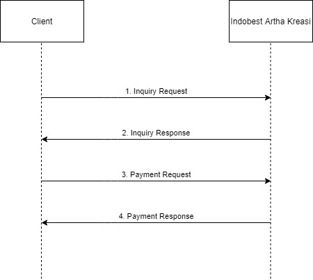
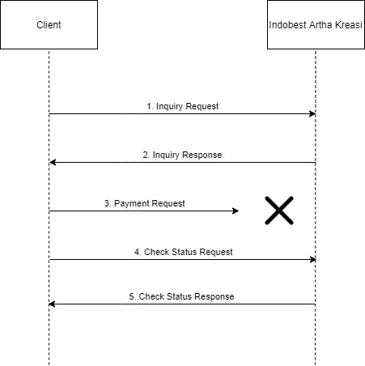
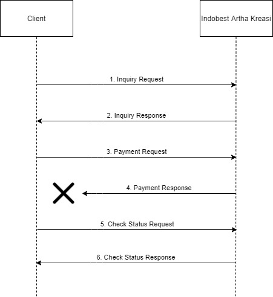

# Postpaid Flow

IAK API in postpaid use **synchronous** flow. After client send request, IAK will give response that contain transaction status and other details. Mostly you will receive below response if the transaction run correctly: 

Response code | Description | Status
---------|----------|---------
 00 | PAYMENT/INQUIRY SUCCESS | Success
 37 | PAYMENT FAILED | Failed
 39 | PENDING / TRANSACTION IN PROCESS | Pending
 42 | PAYMENT REQUEST HAVEN'T BEEN RECEIEVED | Failed

More response can be find [here](./response-code.md).

## Normal Flow

  1. Client send inquiry request to IAK
  2. IAK give inquiry response to client. Inquiry response basically contains the bill price and other details.
  3. Client send payment request to IAK
  4. IAK give payment response to client

## Request Payment Not Received

  1. Client send inquiry request to IAK
  2. IAK give inquiry response to client. Inquiry response basically contains the bill price and other details.
  3. Client send payment request to IAK but IAK not received the request.
  4. Client send check status request to IAK 
  5. IAK give check status response to client that contain the transaction status and other details.

## Response Payment Not Received

  1. Client send inquiry request to IAK
  2. IAK give inquiry response to client. Inquiry response basically contains the bill price and other details.
  3. Client send payment request to IAK.
  4. IAK give payment response to client but client not receive the response.
  5. Client send check status request to IAK 
  6. IAK give check status response to client that contain the transaction status and other details.

## Tutorial Video
You can see this video for postpaid flow explanation.

https://youtu.be/b9Z0vQxEwmk