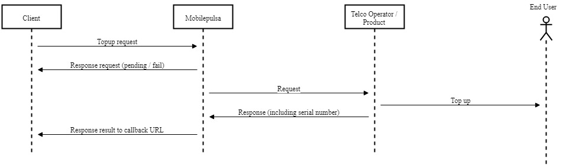
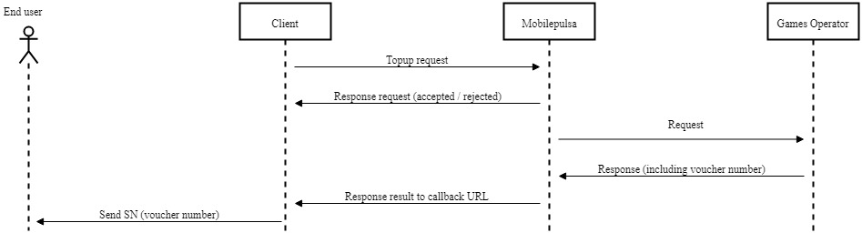
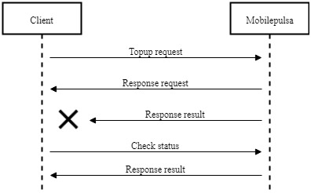

# Prepaid API Transaction Flow

IAK API in prepaid product use **asynchronous** flow. 
In general here is the flow: 
  1. Client call topup request
  2. IAK response **pending** at first
  3. Client will get the updated **status**. There are 2 ways to get updated status:
      - IAK send response of the updated status to your [callback URL]()
      - Client do checkstatus to IAK to get the updated status.

<!-- theme: info -->

> Estimated processing time for each transaction is approximately 1 to 30 seconds

## Flow With Callback

### Mobile Topup and Data Package Flow

### PLN Prepaid Flow

<!-- theme: info -->

> ### Things to note
>
> End user have to input the token number into their home device

### Games Flow

<!-- theme: info -->

> ### Things to note
>
> End user have to input the voucher number into the corresponding game's website.

## Flow Without Callback

If you don't want to use callback, you must call check status API to get the updated status.

