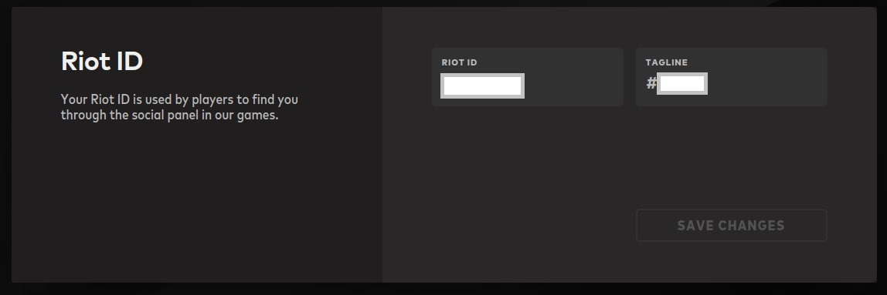
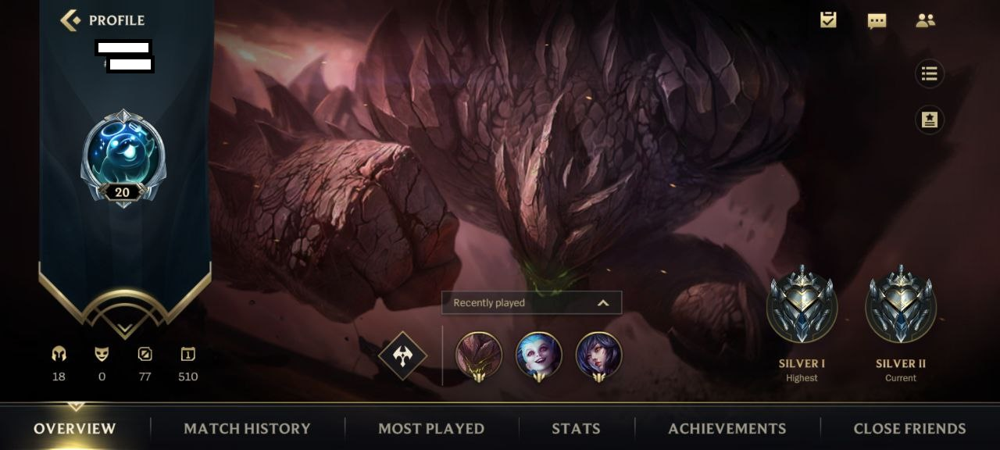

# Game Format Request

There are 2 types of game product:
 1. **Direct top up**

    For this type, the balance is injected directly to player account. To use [top up](./core/v2/transaction/top-up.md) service, you need to provide player id as **hp** field. This player id has different format for different game.
    There are 2 services to check format player id:

      Format hp

      Format hp is the format that you need to input as the hp field in [top up](./core/v2/transaction/top-up.md). 
      To see format hp, you can use [api services](./core/v2/inquiry/game/game-format-hp.md) or use the [table](#format-hp) below.

      Server List 

      After you know the format hp, some of format require **server_id**. To get server_id list you can use [api services](./core/v2/inquiry/game/game-server.md) or use the [table](#server-list) below.

      <!-- theme: info -->
      > List of game product that need to direct top up is [here](#format-hp).

 2. **Redeem voucher**

    For this type, user need to redeem the voucher manually. Beside game code that listed [here](#format-hp), you can directly do [top up](./core/v2/transaction/top-up.md) because it doesn't need player id validity. See how to redeem voucher for each game [here](https://help.iak.id/category/syarat-dan-ketentuan/panduan-redeem-voucher-game).

    <!-- theme: info -->
    > List of game product that need to redeem voucher is beside the game code listed [here](#format-hp).

## Format hp
Below is the format player id for each game code.

Name | **game_code** | **hp** format
---------|----------|---------
 Mobile Legend | 103 | {userid}\|{zoneid}
 Ragnarok | 127 | {userid}\|{serverid}
 Point Blank | 130 | {userid}
 Free Fire | 135 | {userid}
 Speed Drifters | 136 | {userid}
 Arena of Valor | 139 | {userid}
 Bleach Mobile 3D | 140 | {rolename}\|{userid}\|{serverid}
 Era of Celestial | 141 | {rolename}\|{userid}\|{serverid}
 Dragon Nest | 142 | {rolename}\|{serverid}
 Call of Duty | 146 | {userid}
 Marvel Super War | 150 | {userid}
 Light of Thel:Glory of Cepheus | 152 | {userid}
 Lords Mobile | 153 | {userid}
 Life After | 154 | {userid}\|{serverid}
 Higgs Domino | 168 | {userid}
 Genshin Impact | 172 | {userid}\|{serverid}
 LoL Wild Rift | 176 | {userid}\|{tag}
 
 <!-- theme: info -->

> - **userid** = User ID 
> - **zoneid** = Zone ID
> - **rolename** = Player name
> - **serverid** = Server ID. See [here](#inquiry-game-server) for server id.
> - **tag** = Tagline. You can get from https://account.riotgames.com/ 
>   
>   or from inside the game 
>   

## Server List

Below is available game code for [inquiry game server](./core/v2/inquiry/game-server.md)

Name | **game_code**
---------|----------
 Mobile Legend | 103
 Ragnarok | 127
 Bleach Mobile 3D | 140
 Era of Celestials | 141
 Dragon Nest | 142
 Genshin Impact | 172
